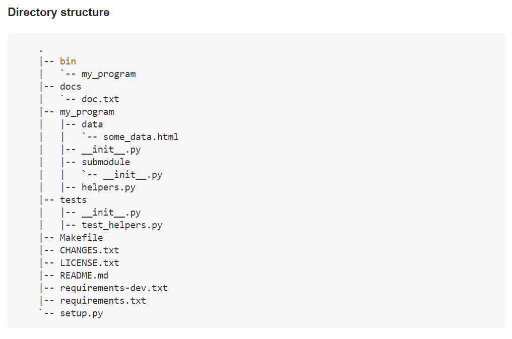

# thesis-device-app
The device application 
## Directory structure

[url of directory structure](https://towardsdatascience.com/ultimate-setup-for-your-next-python-project-179bda8a7c2c)

D. -T. Tran, V. -K. Nguyen, N. -T. Nhan, D. -H. Nguyen and H. -A. Pham, "A Low-Cost High-Accuracy Thermal Camera Using Off-the-shelf Hardware Devices," 2021 9th International Conference on Information and Communication Technology (ICoICT), 2021, pp. 434-439, doi: 10.1109/ICoICT52021.2021.9527417.
